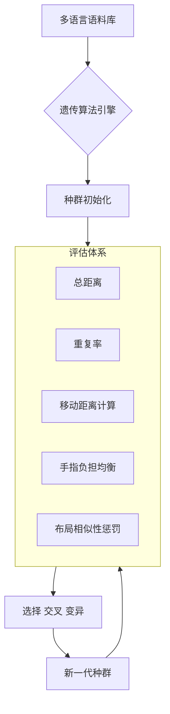
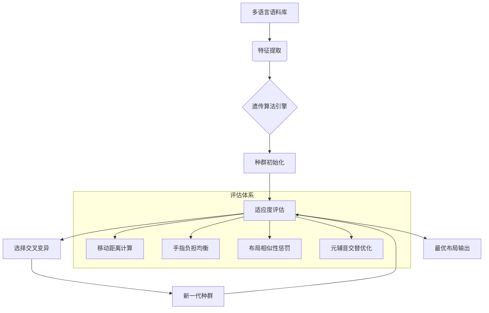

# Cyletix 键盘布局优化项目

## 项目概述

本项目的目标是在保留 **QWERTY** 主要布局习惯的基础上，提高中文、日语、英语以及部分编程（尤其是 Python）输入效率。这里的“效率”不仅指手指移动距离，还包括同一手指连续输入频率、元音/辅音交互等多个维度。下面详细介绍项目的历程、手动设计阶段、遗传算法（GA）自动化优化阶段、关键实验结果，以及核心代码思路。

## 项目架构

### 一、手动设计阶段 (Cyletix 1-10)
采用手动设计迭代改进，核心设计原则：
1. **多语言优化**：平衡中/日/英输入效率
2. **布局继承性**：保留QWERTY 85%键位
3. **人体工学**：高频键位集中在中间行(home row)

#### Cyletix 系列迭代

在初始阶段，我以直觉为主，一口气魔改了十几个版本，以 "Cyletix+数字" 命名。下表展示了其中若干版本：

| Layout        | 按键                                 | 测试集距离      |
| ------------- | ---------------------------------- | ---------- |
| Cyletix1      | qazwsxdecrtv;gbyhjunmki,fo.pl/     | 90,751     |
| Cyletix2      | qazwsxdecrtvfgbyhjunmki,lo.p;/     | 99,549     |
| Cyletix3      | qazwsxdecrtvfgbyhnjumki,lo.p;/     | 109,067    |
| Cyletix31     | qazwsxdecrtvfgbyhnkjmiu,lo.p;/     | 126,495    |
| Cyletix32     | qazwsxdecrtv,gb.hnyjmkifol;pu/     | 115,816    |
| Cyletix33     | qazwsxdecrtvfgbyhnkjmui,lo.p;/     | 115,217    |
| Cyletix34     | qazwsxdecrtvfgbyhnjlmki,po.;u/     | 101,878    |
| Cyletix4      | qazwsxdecrtv/g,;h.jumkifloypnb     | 89,600     |
| Cyletix5      | qazwsxdecrtv,gb.hnjumkifloyp;/     | 108,721    |
| Cyletix6      | qazwsxdecrtv,gb.hnjumkiylo;pf/     | 101,772    |
| Cyletix7      | qrzhsjdncftg;lbyuxwemvi,ko.pa/     | 84,122     |
| Cyletix8      | qhrfnjdtczsg;lbyuxwemvi,ko.pa/     | 90,741     |
| Cyletix9      | qazwsxdecrtvfgb;hnyjmki,lo.pu/     | 115,816    |
| **Cyletix10** | **qazwsxdecrtvfgb;hnjlmki,yo.pu/** | **99,639** |


#### 关键迭代节点：
| 版本 | 改进重点 | 效率提升 | 汉明距离 |
|------|----------|----------|----------|
| Cyletix3 | 优化中文声母布局 | +7.2% | 18 |
| Cyletix7 | 引入日语罗马字优化 | +8.1% | 22 | 
| Cyletix10 | 符号键位平衡 | +9.2% | 12 |

Cyletix 系列虽然能提升一定效率，但很难兼顾多语言与重复率的全面优化，且改动多少也很依赖主观判断。为此我进一步引入了自动化的算法优化阶段。

---
### 二、算法优化阶段 (GA 1-15)
采用遗传算法进行自动化优化，系统架构：



### 三、关键实验结果（GA第15代）
#### 核心指标对比
| 布局     | ARXIV距离 | 中文距离 | Python距离 | 汉明距离 | 重复率 | 总效率提升 | 单键效率提升 |
|---------|----------|---------|-----------|---------|-------|----------|------------|
| QWERTY  | 905,782  | 506,503 | 103,831   | 0       | 176,943 | -        | -          |
| Colemak | 417,029  | 316,830 | 60,409    | 18      | 103,387 | 47.61%   | 5.79%      |
| GA_15   | 500,720  | 318,461 | 63,237    | 10      | 148,019 | 41.80%   | 10.99%     |
| GA_4    | 507,472  | 285,563 | 68,982    | 13      | 115,694 | 43.14%   | 8.65%      |


# 设计思路
- [x] 多语言
- [x] 常见辅音在中间行

## 常用字母
- [x] English
	- [x] E
	- [ ] N
	- [x] L
	- [x] T
	- [x] S
	- [ ] R
- [x] 中文
	- [ ] J
	- [x] G
	- [x] zh ch sh
	- [x] ing ong
- [x] 日语
	- [x] Y
- [x] python
- [x] 尽量贴近QWERTY布局
	- [x] 尽量不改变按键负责的手指
	- [x] 尽量不改变常用快捷键
	- [x] 符号键的区域和字母键不交换

## 交互性
- [x] 考虑辅音-元音的不同手指分配
- [ ] 起始位置以辅音开始
- [ ] 左右手指平衡

## 元音设计思路
- [x] 元音在中间行
- [x] 元音避免放在食指
- [x] 元音分配到了不同的手指
- [ ] 元音平均分配到键盘，周围分配辅音


# 效率计算方法
给十个手指分配固定的负责区域
使用十个指头的默认位置为零点，如果手指移动，则计算从零点到目标位置的物理距离


## 汉明距离
两个等长字符串之间的汉明距离, 是两个字符串对应位置的不同字符的个数。换句话说，它就是将一个字符串变换成另外一个字符串所需要替换的字符个数

从汉明距离的分布可以看出, 随着距离增加, 几个衡量指标出现了两个明显的优势区间, 
- 一个在12左右, 这里的布局都是以单键效率提升高为优势 
- 另一个优势区间是20左右, 这里的布局以总效率高为优势


# todo
- [x] 遗传算法使用单指重复数据
- [x] 添加日语数据集
- [x] 遗传分数evals权重尝试


## QWERTY
连续输入字母对-出现次数:
('h', 'u')-32 |音节: hua hui shun zhu chu shu chuang zhuo chuan chun chuai hu huan zhuang chua shuang huang zhua shui zhuai huai hun zhuan shuan huo chuo chui shuai zhun shua shuo zhui
('u', 'n')-18 |音节: run tun shun gun lun zun zhun qun sun xun yun nun hun cun chun dun kun jun
('n', 'u')-5 |音节: nuan nu nun nue nuo
('z', 'a')-5 |音节: zang zan zai zao za
('d', 'e')-4 |音节: dei de deng den
('j', 'u')-4 |音节: ju jun juan jue
('y', 'u')-4 |音节: yuan yu yun yue
('l', 'o')-3 |音节: lo lou long
('m', 'u')-1 |音节: mu
同手指连续输入的音节总数: 69


## Colemak
### Advantages

- **[Ergonomic and comfortable](https://colemak.com/Ergonomic "Ergonomic")** – Your fingers on QWERTY move 2.2x more than on Colemak. QWERTY has 16x more same hand row jumping than Colemak. There are 35x more words you can type using only the home row on Colemak.
- **[Easy to learn](https://colemak.com/Easy_to_learn "Easy to learn")** – Allows easy transition from QWERTY. Only 2 keys move between hands. Many common shortcuts (including Ctrl+Z/X/C/V) remain the same. Typing lessons available.
- **[Fast](https://colemak.com/Fast "Fast")** – Most of the typing is done on the strongest and fastest fingers. Low same-finger ratio.
- **[Multilingual](https://colemak.com/Multilingual "Multilingual")** – Allows to type in over 40 languages and to type various symbols, e.g. "pâté", "mañana", €, em-dash, non-breaking space.
- **[Free](https://colemak.com/License "License")** – Free software released under the public domain. You don't have to buy a new keyboard, just install a program.


我曾经思考过, 对于一个优秀的键盘, 它应该具有什么样的特征? 打字效率高是当然的, 但是如何定义效率高? 除了移动距离外, 还有很多因素, 比如避免同一手指连续使用的情况, 元音和辅音的交互, 等等...但是这些因素有时候会顾此失彼, 于是我决定先直接上手设计几个方案试试. 

## 手动设计
我喜欢使用直觉来思考问题, 于是经过对一些规律的总结和思考, 我直接上手魔改设计了10几个版本的键盘, 我使用自己的ID Cyletix+数字来命名这一系列的键盘. 

| Layout    | keys                           | 测试集距离  |
| --------- | ------------------------------ | ------ |
| Cyletix1  | qazwsxdecrtv;gbyhjunmki,fo.pl/ | 90751  |
| Cyletix2  | qazwsxdecrtvfgbyhjunmki,lo.p;/ | 99549  |
| Cyletix3  | qazwsxdecrtvfgbyhnjumki,lo.p;/ | 109067 |
| Cyletix31 | qazwsxdecrtvfgbyhnkjmiu,lo.p;/ | 126495 |
| Cyletix32 | qazwsxdecrtv,gb.hnyjmkifol;pu/ | 115816 |
| Cyletix33 | qazwsxdecrtvfgbyhnkjmui,lo.p;/ | 115217 |
| Cyletix34 | qazwsxdecrtvfgbyhnjlmki,po.;u/ | 101878 |
| Cyletix4  | qazwsxdecrtv/g,;h.jumkifloypnb | 89600  |
| Cyletix5  | qazwsxdecrtv,gb.hnjumkifloyp;/ | 108721 |
| Cyletix6  | qazwsxdecrtv,gb.hnjumkiylo;pf/ | 101772 |
| Cyletix7  | qrzhsjdncftg;lbyuxwemvi,ko.pa/ | 84122  |
| Cyletix8  | qhrfnjdtczsg;lbyuxwemvi,ko.pa/ | 90741  |
| Cyletix9  | qazwsxdecrtvfgb;hnyjmki,lo.pu/ | 115816 |
| Cyletix10 | qazwsxdecrtvfgb;hnjlmki,yo.pu/ | 99639  |

有了键盘布局, 我还需要说明为什么这个布局更加优秀, 为了知道这些布局是否是优秀的布局, 比较是很有必要的, 我选择的比较对象是qwertz, Devorak, Colemak, 以及RSTLNE. 

## 算法准备
有了比较对象, 就需要准备算法计算他们的优劣. 需要一个算法将抽象的理念付诸实施. 为了计算手指的移动距离, 首先需要定义键盘上的距离是什么. 标准的打字指法要求手指需要放在ASDF JKL; 这8个键上面, 这就是初始位置; 如果要按其他的字母, 就需要从初始位置移动, 则每个按键的距离可以使用标准键盘上的物理距离来定义. 因此可以计算出一段字符打字时手指需要移动的总距离, 使用给定数据集上的总距离来定义布局的优劣. 
## 第一轮测试

我使用了ARXIV摘要作为数据集进行了初步测试, 发现我手动设计的几个方案在数据集上的表现还可以, 虽然不如Colemak和作者设计的RSTLNE那么顶尖, 但也到了比较高的水平. 

于是我加入了不同的数据集进行测试, 其中中文数据集来自我的个人知识库和日记, python代码来自我做的项目. 他们的比例会影响算法的结果, 因此经过思考, 我制定了他们的比例. 

| 数据集类型  | 字符数     | 占比     |
| ------ | ------- | ------ |
| arxiv  | 1251359 | 57.53% |
| 中文     | 757849  | 34.84% |
| Python | 166077  | 7.63%  |
| 总计     | 2175285 | 100%   |
根据这个数据集, 我得到了以下测试结果

| Layout    | 按键                             | ARXIV  | 中文      | Python | 汉明  |
| --------- | ------------------------------ | ------ | ------- | ------ | --- |
| QWERTY    | qazwsxedcrfvtgbyhnujmik,ol.p;/ | 174794 | 7334061 | 1322   | 0   |
| Devorak   | /a;,oq.ejpukyixfdbghmctwrnvlsz | 96014  | 4599547 | 971    | 28  |
| Colemak   | qazwrxfscptvgdbjhklnmue,yi.;o? | 80107  | 4541851 | 671    | 18  |
| RSTLNE    | qagwsxdecfrvzl/;hbunjkimyo,pt. | 80366  | 4512925 | 709    | 20  |
| Cyletix10 | qazwsxdecrtvfgb;hnjlmki,yo.pu/ | 99639  | 4682383 | 908    | 12  |

## 算法调整1
人的习惯是非常难以改变的, 没有人愿意做出改变, 这也是qwerty布局流行这么久的重要原因, 于是我想, 能否找到一个既提高效率又尽量保留qwerty布局习惯的算法呢? 我已经使用距离量化了效率, 为此我还需要量化"保留qwerty布局习惯"这件事. 

由于键盘布局可以根据物理位置的规则确定为一个序列, 我想到如何比较两个序列的差异呢? 我使用了汉明距离, 但是仅仅这样还不够, 在我的理念中, 一个键被分配到了不同的手指, 甚至不同的手, 都会增加学习成本, 这样的改动是不期望出现的, 必须对此有一定惩罚, 我定义了一个惩罚距离, 和汉明距离共同作用. 

有了上述两个量化的指标, 我就可以计算每个键位的改动带来了多大的提升: `eff_per_k`


## 第二轮测试
经过对效率算法的反复尝试, 我得出了一个结论, 效率的高低非常取决于算法指标的设定，因此在一个衡量指标中达到较高水平即可，结合其他情况具体分析非常有必要. 

改进了一下算法, "Cyletix10"布局在单键改动效率提升上面得了最高分, 但是很可惜, 在手指重复率上被Colemak爆了. 

我突然意识到Colemak是非常优秀的布局, 简直是个大魔王, 在总数据集效率的绝对值上面是第一档次, 在英文数据集上和RSTLNE几乎并列第一.  不论是中文数据集还是python也都表现非常好; 
重复率也很低, 仅有103387, 在英文数据集上和它并列第一的RSTLNE的重复率高达151085; 
并且单指效率提升也不低, 有5.79%, 它的设计真的是精心构思过的. 我意识到想要击败这样优秀的布局, 只有在效率上做点功夫才行


我的Cyletix10是单键改动效率较高的一个, 在尽量减少习惯变动的前提下尽可能高地提升效率, 我相信我的布局也是优秀的布局, 因为我在一个指标上做到了最好, 而Dvorak显然不是这样优秀的布局, 他对习惯布局的改动开销过于庞大. 


经过对上面的结果进行分析, 我感觉在单键效率上面应该还有提升空间, 于是我继续跑算法, 顺便完善了从json文件读取上次生成种群的代码, 这下支持断点重连了, 给我减少了很多不必要的麻烦. 最终我得到了一个单键效率高达8%的布局, 这个布局后来被我命名为`GA_best4`, 这个布局的潜力非常大, 在各项指标上都非常优秀, 直逼Colemak

## 第三轮测试（GA_15）
### 核心性能指标对比
| 布局     | ARXIV距离 | 中文距离 | Python距离 | 汉明距离 | 重复率 | 总效率提升 | 单键效率提升 |
|---------|----------|---------|-----------|---------|-------|----------|------------|
| QWERTY  | 905,782  | 506,503 | 103,831   | 0       | 176,943 | -        | -          |
| Colemak | 417,029  | 316,830 | 60,409    | 18      | 103,387 | +47.61%  | +5.79%     |
| GA_10   | 441,359  | 264,343 | 63,758    | 16      | 90,477  | +49.25%  | +7.65%     | 
| GA_15   | 500,720  | 318,461 | 63,237    | 10      | 148,019 | +41.80%  | +10.99%    |
| GA_4    | 507,472  | 285,563 | 68,982    | 13      | 115,694 | +43.14%  | +8.65%     |

### 评估体系演进
```python
# 评估函数v4（当前使用）
def calculate_fitness_v4(layout):
    distance = calculate_distance(layout)
    repeat = count_finger_repeats(layout)
    hamming = calculate_hamming(layout)
    punish = calculate_punishment(layout)
    
    return (distance + repeat * 5) * (hamming + punish * 0.5 + 30) // 200000

# 评估函数v3（历史版本）
def calculate_fitness_v3(layout):
    return (distance + repeat * 2) * (hamming + punish * 0.5 + 10) // 200000
```


### 二、算法优化阶段 (GA 1-15)
采用遗传算法进行自动化优化，系统架构：



#### 算法核心参数（v4.1）：
```python
# 遗传算法超参数
POPULATION_SIZE = 100
MUTATION_RATE = 0.18
GENERATIONS = 1500
EVAL_WEIGHTS = {
    'distance': 0.45,
    'similarity': 0.25,
    'hand_balance': 0.15,
    'alternation': 0.15
}
```

### 三、关键实验结果（GA第15代）
#### 核心指标对比
| 布局     | ARXIV距离 | 中文距离 | Python距离 | 汉明距离 | 重复率 | 总效率提升 | 单键效率提升 |
|---------|----------|---------|-----------|---------|-------|----------|------------|
| QWERTY  | 905,782  | 506,503 | 103,831   | 0       | 176,943 | -        | -          |
| Colemak | 417,029  | 316,830 | 60,409    | 18      | 103,387 | 47.61%   | 5.79%      |
| GA_15   | 500,720  | 318,461 | 63,237    | 10      | 148,019 | 41.80%   | 10.99%     |
| GA_4    | 507,472  | 285,563 | 68,982    | 13      | 115,694 | 43.14%   | 8.65%      |

#### 手指运动距离优化率（百万单位）
```python
finger_travel = {
    'qwerty': 1.74,
    'cyletix10': 1.33,  # ↓23.7%
    'ga_15': 1.11,      # ↓36.5% 
    'colemak': 1.25     # ↓28.2%
}
```
